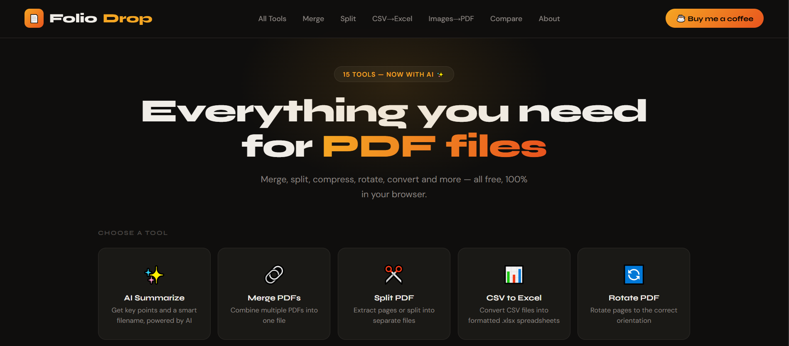
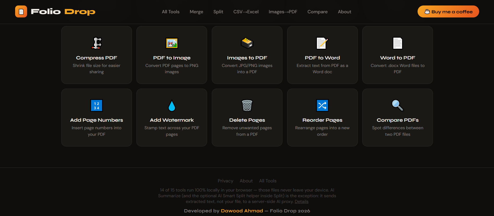
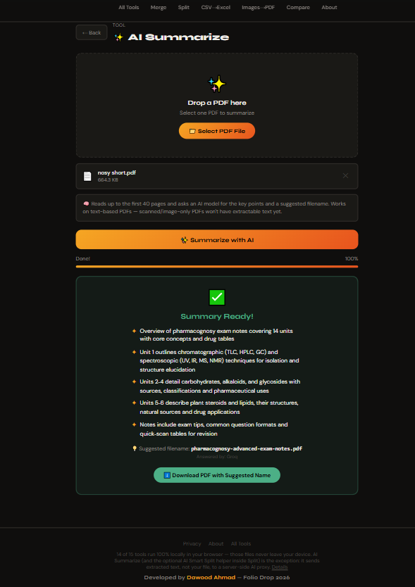

# 📄 Folio Drop — Your PDF Toolkit

**Live app:** **[https://foliodrop-six.vercel.app](https://foliodrop-six.vercel.app)**

Folio Drop is an all-in-one PDF toolkit — 15 tools plus two AI-powered features — that runs almost entirely inside the browser tab. There's nothing to install, no account, and (for 14 of the 15 tools) no upload: your files never leave your device.

---

## 1. The Problem & Who It's For

Almost everyone eventually needs to merge two PDFs, shrink one to email it, or pull a signature page out of a contract. The default fix is one of the big online PDF sites — but nearly all of them work the same way: you **upload your file to their server**, they process it, and you download it back. For a random flyer that's fine. For a payslip, a signed contract, a medical report, or a client's confidential document, it's not something people should have to think twice about — and most don't realize they're doing it.

Folio Drop solves this for **students, freelancers, and office workers who handle PDFs daily** and want the same convenience (merge, split, compress, watermark, convert, etc.) **without handing sensitive documents to a third-party server**. 14 of the 15 tools do the entire transformation in the browser's own memory using JavaScript libraries — the file is read, changed, and handed back as a download, and closing the tab discards everything. Only the two optional AI features (which need a real language model to "read" the document) send anything off-device, and even then it's just the extracted text, not the file itself, and only when the user explicitly clicks that button.

The second problem it solves is **tool sprawl**: instead of bookmarking five different single-purpose sites, it's one place for the everyday PDF tasks people repeat constantly.

---

## 2. Features

**Core PDF tools (14, fully local — pdf-lib / PDF.js in the browser):**
| Tool | What it does |
|---|---|
| 🔗 Merge PDFs | Combine multiple PDFs into one, in the order you choose |
| ✂️ Split PDF | Split into every page as a separate file, or a custom page range (`1-3, 5, 7-9`) |
| 🔄 Rotate PDF | Rotate all/odd/even pages 90°, 180°, or 270° |
| 🗜️ Compress PDF | Shrink file size by re-rendering pages as compressed images (3 quality levels) |
| 🖼️ PDF to Image | Export each page as a PNG at 72/144/216 DPI |
| 🗃️ Images to PDF | Turn a batch of JPG/PNG/WEBP images into one PDF (fit-to-image, A4, or Letter) |
| 📝 PDF to Word | Convert to a `.docx`, either pixel-perfect layout-preserved or extracted editable text |
| 📄 Word to PDF | Convert `.docx` / `.doc` / `.odt` / `.rtf` straight to PDF, no print dialog |
| 🔢 Add Page Numbers | 4 position options, 3 numbering formats, custom start number |
| 💧 Add Watermark | Diagonal, horizontal, or corner-stamp text watermark at 3 opacity levels |
| 🗑️ Delete Pages | Click pages visually to mark and remove them |
| 🔀 Reorder Pages | Drag pages into a new order before rebuilding the file |
| 🔍 Compare PDFs | Visual diff between two PDF versions — additions in green, removals in red, downloadable diff report |
| 📊 CSV to Excel | Convert `.csv` to a formatted `.xlsx`, with delimiter auto-detect and header handling |

**AI-powered features (2, server-assisted):**
| Tool | What it does |
|---|---|
| ✨ AI Summarize | Reads up to the first 40 pages of a PDF and returns 3–6 key bullet points plus an AI-suggested filename |
| ✨ AI: Suggest Split Points | Inside the Split tool — samples every page and asks the AI to propose where a document naturally breaks (new chapter, new invoice, new topic), then pre-fills the page ranges for review |

Every tool shows progress, a clear success state, and a direct download — no tool requires an account or a payment.

---

## 3. The AI Feature — Details & Prompts

Both AI features call the same serverless proxy pattern: the browser extracts text locally first, sends **only that text** (never the file) to a Vercel serverless function, which forwards it to an LLM and returns structured JSON. The proxy tries **Groq** (`openai/gpt-oss-120b`) first for speed, and automatically falls back to **Gemini** (`gemini-3.5-flash`) if Groq is unavailable, rate-limited, or not configured.

### ✨ AI Summarize — system prompt (`api/summarize.js`)
```
You are analyzing text extracted from a PDF document. Respond with ONLY valid JSON
(no markdown fences, no commentary) in exactly this shape:
{"summary": ["point 1", "point 2", "point 3"], "filename": "short-descriptive-name"}

- "summary": 3 to 6 short bullet points capturing the key content, in your own words.
- "filename": a short, descriptive, lowercase, hyphenated filename with no extension and no spaces
(max 6 words), based on the document's actual content.

Document text: <first ~18,000 characters extracted from the PDF>
```
The response is parsed as JSON, sanitized, and used both to display the bullet-point summary and to rename the downloaded file automatically.

### ✨ AI: Suggest Split Points — system prompt (`api/smart-split.js`)
```
Below are short text snippets from each page of a PDF, in order. Identify natural split points —
e.g. a new chapter, a new invoice, a new section, or an unrelated topic starting.
Respond with ONLY valid JSON (no markdown fences, no commentary) in exactly this shape:
{"splits": [8, 15], "reason": "one short sentence explaining the split points"}

"splits" should list the page numbers where a NEW section STARTS (never include page 1).
If the document reads as one continuous piece with no clear break, return {"splits": [], "reason": "..."}.

<a ~400-character snippet from every page, in order>
```
The returned page numbers are validated (must be integers, in range, sorted) before being used to pre-fill the Split tool's custom range field, so a malformed AI response can never break the UI.

**Why this counts as a real AI feature, not decoration:** both features change what the user actually does next — Summarize renames the file for them, and Smart Split fills in the exact page ranges instead of asking the user to guess where a 40-page merged PDF should be cut.

---

## 4. Tools, Services & Models Used

- **Frontend:** Vanilla JavaScript, HTML5, CSS3 — no framework, no build step
- **PDF engine:** [pdf-lib](https://pdf-lib.js.org/) (create/rewrite PDF structure — merge, split, rotate, watermark, page numbers, delete/reorder) and [PDF.js](https://mozilla.github.io/pdf.js/) (render pages, extract text/images)
- **Document conversion:** [Mammoth.js](https://github.com/mwilliamson/mammoth.js) (Word → HTML/PDF), [html2canvas](https://html2canvas.hertzen.com/) (layout capture for Word→PDF)
- **Archiving:** [JSZip](https://stuk.github.io/jszip/) (bundling multi-file outputs like page-per-file splits)
- **Backend:** Vercel Serverless Functions (Node.js) — two thin endpoints, `/api/summarize` and `/api/smart-split`
- **AI models:** [Groq](https://groq.com/) running `openai/gpt-oss-120b` (primary, fast free-tier inference), with [Google Gemini](https://ai.google.dev/) `gemini-3.5-flash` as an automatic fallback
- **Hosting/Deployment:** [Vercel](https://vercel.com/)
- **PWA support:** installable, works offline for the local tools via a service worker (`sw.js`) — unrelated to and separate from the AI features, which need network + server

---

## 5. Screenshots

**Home page — hero and first row of tools**


**Full tool grid — remaining 10 tools, plus footer privacy note**


**AI Summarize — real output on an uploaded PDF**


---

## 6. How to Run This Project

**Option A — just use it (no setup):**
Open the live URL: **https://foliodrop-six.vercel.app** — all 15 core tools work immediately, no signup.

**Option B — run the frontend only, locally:**
```bash
git clone https://github.com/itsdawoodahmad/foliodrop.git
cd foliodrop
# open index.html directly in a browser
```
All core tools work this way. The two AI buttons will show a friendly error, since there's no server at `file://` to answer `/api/...` requests.

**Option C — run the full app (frontend + AI features) locally:**
```bash
git clone https://github.com/itsdawoodahmad/foliodrop.git
cd foliodrop
npm i -g vercel
cp .env.local.example .env.local   # then paste in your own Groq and/or Gemini API key
vercel dev
```
`vercel dev` serves the static site and the `api/` serverless functions together on one local URL. Either `GROQ_API_KEY` or `GEMINI_API_KEY` alone is enough for the AI features to work; the proxy skips whichever isn't set.

**Deploying your own copy:**
1. Push the repo to your own GitHub.
2. On [vercel.com](https://vercel.com) → **Add New Project** → import the repo (no build configuration needed, Vercel auto-detects the static files + `api/` folder).
3. Add `GROQ_API_KEY` and/or `GEMINI_API_KEY` under **Settings → Environment Variables**, then redeploy.

No API keys or secrets are committed to this repository — they're read only from environment variables at runtime (`.env.local` is git-ignored).

---

## 7. Author

**Dawood Ahmad** — [Instagram](https://www.instagram.com/itsdawoodahmad?igsh=MXRiMGJwNnVpcno5YQ==)

Folio Drop — Version 1.0
